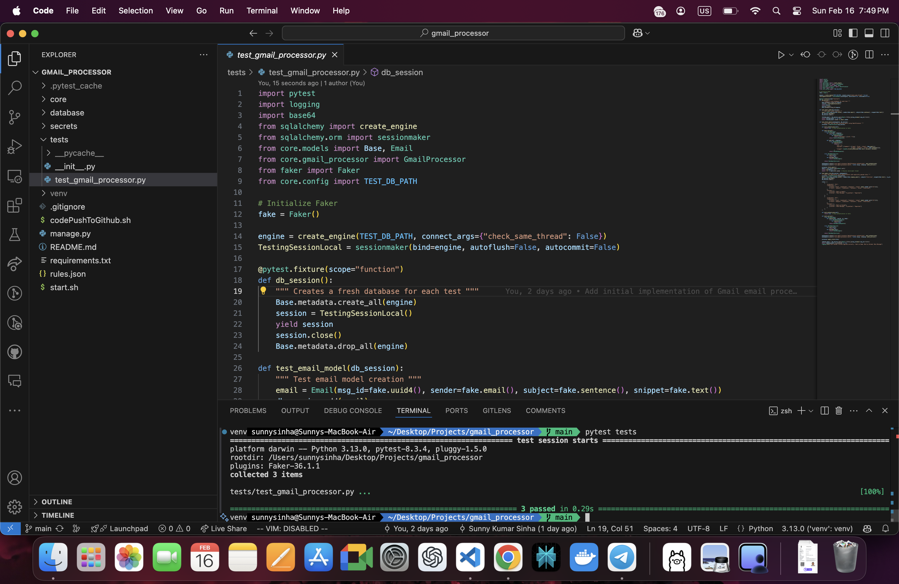

# Gmail Email Processor

A standalone Python script that integrates with Gmail API and performs some rule based operations on emails.

This project authenticates with **Gmail API** using OAuth, fetches emails, and applies rule-based actions. It uses **SQLAlchemy (SQLite3)** for storage, **Pydantic** for validation, and **Click** for CLI-based execution.

## 🚀 Features

- ✅ **Authenticate using OAuth** (No IMAP)
- ✅ **Fetch emails from Gmail**
- ✅ **Store emails in SQLite3 using SQLAlchemy**
- ✅ **Apply rule-based filtering from a JSON file**
- ✅ **Command-line interface (CLI)**
- ✅ **Modular, maintainable, and scalable**

## Task Details & Breakdown:
1. This project is meant to be a standalone Python script, not a web server project.
Use any 3rd party libraries you need for the assignment.
2. Authenticate to Google’s Gmail API using OAuth (use Google’s official Python
client) and fetch a list of emails from your Inbox. Do NOT use IMAP .
3. Come up with a database table representation and store these emails there. Use
any relational database for this (Postgres / MySQL / SQLite3).
4. Now that you can fetch emails, write another script that can process emails (in
Python code, not using Gmail’s Search) based on some rules and take some
actions on them using the REST API.
5. These rules can be stored in a JSON file. The file should have a list of rules.
Each rule has a set of conditions with an overall predicate and a set of actions.

## 📌 Installation

### 1️⃣ Clone the Repository
```sh
git clone https://github.com/thesunnysinha/gmail_processor.git
cd gmail_processor
```

### 2️⃣ Create a Virtual Environment
```sh
python3 -m venv venv
source venv/bin/activate   # macOS/Linux
venv\Scripts\activate      # Windows
```

### 3️⃣ Install Dependencies
```sh
pip install -r requirements.txt
```

### 4️⃣ Set Up OAuth Credentials
- Go to [Google Cloud Console](https://console.cloud.google.com/)
- Create OAuth 2.0 credentials for Gmail API
- Download `credentials.json` and place it in the project's secret directory.

### 📌 Usage

🔹 **Initialize Database**
```sh
python manage.py migrate
```
🔹 **Authenticate & Fetch Emails**
```sh
python manage.py fetch
```
🔹 **Apply Rules to Emails**
```sh
python manage.py applyrules
```

### 📌 Running Tests
```sh
pytest tests/
```

## Test Result



### 📌 Example Rule in rules.json
```json
[
    {
        "predicate": "All",
        "conditions": [
            {"field": "From", "predicate": "Contains", "value": "example.com"},
            {"field": "Subject", "predicate": "Contains", "value": "Meeting"}
        ],
        "actions": [
            {"action": "Mark as Read"},
            {"action": "Move Message", "to_mailbox": "Important"}
        ]
    }
]
```

### 📌 Tech Stack
- Python (3.8+)
- SQLAlchemy (ORM)
- Pydantic (Data validation)
- Google API Client (OAuth)
- Click (CLI)
- SQLite3 (Database)
- Pytest (Testing)